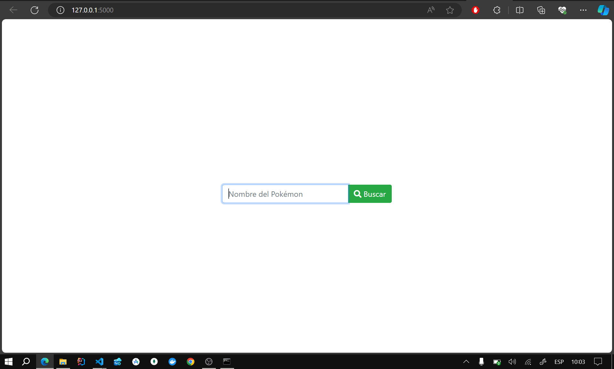
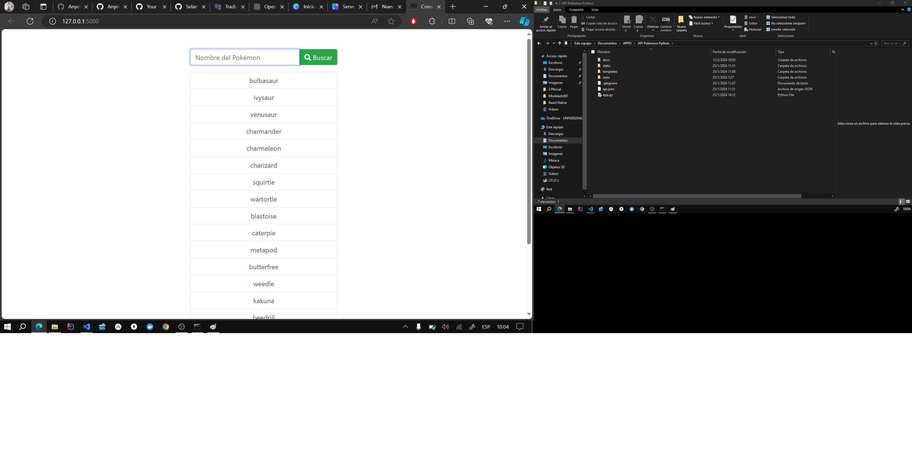
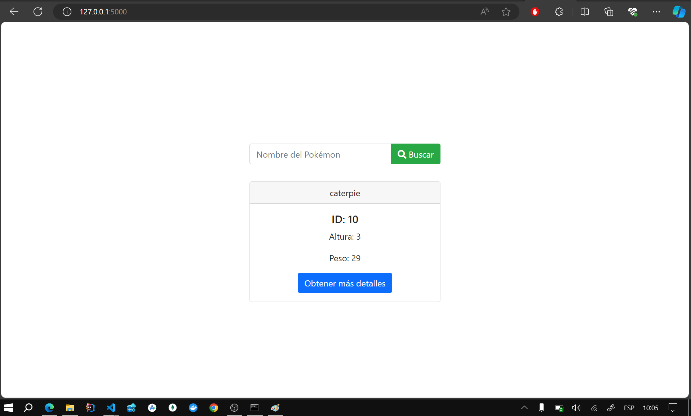

# Pokemon API Consumption with Flask

This Flask project allows users to search for information about different Pokémon using the [PokeAPI](https://pokeapi.co/). Users can input a Pokémon's name and retrieve data such as its ID, height, and weight.

## Result
### Home
 
### Suggestion (beta)
 
### Search

## Installation

1. Clone this repository to your local machine.
2. Ensure you have Python installed. This project was created with Python 3.x.
3. Install the project dependencies. You can do this by running `pip install -r requirements.txt`.

## Usage

1. Run the Flask application by executing `python app.py`.
2. Open your browser and go to `http://localhost:5000`.
3. On the home page, enter a Pokémon's name in the search field and press the "Search" button.
4. The Pokémon's data will be displayed if it is found in the database.

## Project Structure

- `app.py`: Contains the logic for the Flask application.
- `index.html`: The HTML template for the user interface.
- `static/`: Directory containing static files such as CSS and JavaScript.
- `templates/`: Directory containing HTML templates.

## Technologies Used

- Python
- Flask
- HTML
- CSS
- JavaScript
- Bootstrap

## Contributing

If you'd like to contribute to this project, feel free to fork it and send pull requests.

## Credits

This project was created by Anyel EC
